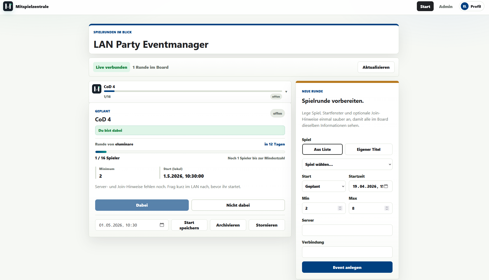
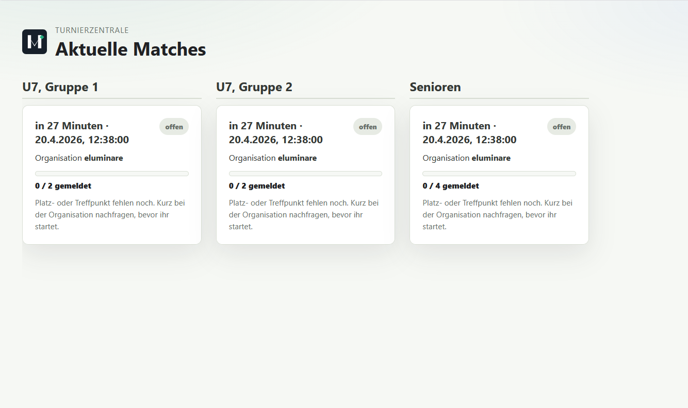

# Hermes / Matchdesk / Mitspielzentrale

Codename Hermes ist eine responsive WebApp für die Organisation von Spielrunden. Gestartet für LAN-Parties, können nun auch Turniere für verschiedene Sportarten darüber verwaltet werden. Die Auswahl findet anhand von Projekttemplates statt. User melden sich mit Username und E-Mail-Einmalcode an, Manager / Organisatoren legen Events an, und Teilnehmer stimmen mit `dabei` oder `nicht dabei` ab.

Build- und Release-Hinweise liegen in [`building.md`](building.md).


## Oberfläche



Die WebApp ist in getrennte Arbeitsbereiche aufgeteilt:

- `#Start`: Eventübersicht für Abstimmung, Status, Startzeit und Serverdaten, sowie Eventverwaltung.
- `#login`: Login vor der Anmeldung; nach dem Login wird daraus `Profil` mit Konto, **API-Tokens** (Integrationen), Logout, Notification-Einstellungen und Geräteverwaltung.
- `#infos`: Falls aktiviert, stehen hier weitere Informationen rund um das Hauptevent bereit
- `#admin`: Userverwaltung, Rollenzuweisung, Invite-Codes, Audit-Log und globale Einstellungen.

Im Adminbereich können Designfarben und Theme unter dem Unterpunkt **Design** gepflegt werden. Diese Werte liegen wie die übrigen App-Einstellungen in `app_settings` und werden beim Laden der WebApp angewendet.

Admins sehen im Bereich `#admin` außerdem ein Audit-Log. Dort werden Login/Logout, User- und Settingsänderungen, Eventaktionen, Teilnahmen sowie Backup/Restore-Aktionen chronologisch angezeigt.

Admins können die öffentliche Registrierung aktivieren und Invite-Codes für LAN-Partys erstellen. Neue User registrieren sich dann mit Invite-Code, Username und E-Mail-Adresse; danach wird der Login-Code per E-Mail verschickt.

Invite-Codes sind dabei **credential-like**: Sie werden von Hermes generiert, sind für Admins sichtbar und sollten wie Zugangsdaten behandelt werden. Audit-Logs enthalten bewusst nur eine maskierte Variante (kein vollständiger Invite-Code in den Metadaten).

## Kiosk Modus
Falls aktiviert, kann über eine entsprechend generierte URL eine Übersicht der anstehenden Spiele angezeigt werden. Die Funktion ist primär für die Darstellung auf Fernsehern und Co. vorgesehen.


## Wo Werden Einstellungen Gespeichert?

Hermes speichert Einstellungen in SQLite in der Tabelle `app_settings`.

Die SQLite-Datei liegt lokal unter:

```text
HERMES_DB_PATH
```

Im Docker-Setup ist das:

```text
/data/hermes.sqlite
```

Mit S3-Backend bleibt SQLite die lokale Arbeitsdatenbank. S3 wird als persistentes Snapshot-Backend verwendet: Beim Start wird die Datenbank aus S3 wiederhergestellt, falls lokal keine Datenbank existiert, und nach Schreiboperationen wird ein Snapshot nach S3 hochgeladen.

Das ist absichtlich kein verteiltes Live-Dateisystem. Hermes ist für eine einzelne laufende Instanz gedacht.

## Wasabi S3

Die Vorgabe ist eingetragen:

```env
HERMES_STORAGE_BACKEND=s3
HERMES_S3_BUCKET=hermes-storage
HERMES_S3_REGION=eu-central-2
HERMES_S3_ENDPOINT=https://s3.eu-central-2.wasabisys.com
HERMES_S3_CREDS_FILE=./s3.creds
HERMES_S3_DB_KEY=hermes.sqlite
HERMES_S3_RESTORE_MODE=if-missing
```

`s3.creds` wird nicht versioniert. Unter Docker wird die Datei readonly nach `/run/secrets/s3.creds` gemountet.

Unterstützte Formate für `s3.creds`:

```env
AWS_ACCESS_KEY_ID=...
AWS_SECRET_ACCESS_KEY=...
```

Alternativ:

```env
access_key=...
secret_key=...
```

Wasabi-Export mit Bindestrich wird ebenfalls erkannt:

```env
access-key=...
secret-key=...
```

Oder zwei Zeilen ohne Schlüsselname:

```text
ACCESS_KEY
SECRET_KEY
```

## Lokal Starten

```bash
npm install
cp .env.example .env
npm run db:bootstrap-admin
npm run build
npm start
```

Für produktive Deployments sollte zusätzlich ein eigenes CSRF-Secret gesetzt werden (in `.env`):

```env
HERMES_CSRF_SECRET=change-me
```

Die App läuft danach auf:

```text
http://localhost:3000
```

Direkte Einstiege:

```text
http://localhost:3000/#events
http://localhost:3000/#login
http://localhost:3000/#manager
http://localhost:3000/#admin
```

## Docker

```bash
cp .env.example .env
docker compose run --rm hermes node dist-server/db/bootstrap-admin.js
docker compose up --build
```

Das Compose-Setup nutzt:

- SQLite unter `/data/hermes.sqlite`
- Docker Volume `hermes-data`
- Wasabi S3 Snapshot `s3://hermes-storage/hermes.sqlite`
- Credentials aus `./s3.creds`

## Mail

Login-Codes werden per SMTP versendet. Für lokale Tests kann `HERMES_MAIL_MODE=console` genutzt werden.

```env
HERMES_MAIL_MODE=smtp
HERMES_MAIL_FROM=Hermes <hermes@example.test>
HERMES_SMTP_HOST=smtp.example.test
HERMES_SMTP_PORT=587
HERMES_SMTP_SECURE=false
HERMES_SMTP_SECURITY=starttls
HERMES_SMTP_USER=
HERMES_SMTP_PASSWORD=
```

Hinweis: Für Port `587` ist normalerweise STARTTLS korrekt (`HERMES_SMTP_SECURITY=starttls`). Für Port `465` ist implizites TLS korrekt (`HERMES_SMTP_SECURITY=tls`). Der Fehler `wrong version number` bedeutet fast immer, dass implizites TLS gegen einen STARTTLS-Port gesprochen wurde.

## Push Notifications

Web Push benötigt VAPID Keys:

```bash
npx web-push generate-vapid-keys
```

Danach in `.env` eintragen:

```env
HERMES_VAPID_SUBJECT=mailto:admin@example.test
HERMES_VAPID_PUBLIC_KEY=
HERMES_VAPID_PRIVATE_KEY=
```

Browser erlauben Push Notifications nur in einem Secure Context. `http://localhost` funktioniert für lokale Tests, normale HTTP-LAN-Adressen wie `http://192.168.x.x` gelten aber nicht als Secure Context. Hermes liefert kein SSL/TLS, keinen Reverse Proxy und kein Zertifikatsmanagement mit.

Hermes setzt bei Push-Benachrichtigungen eine Vibrationssequenz und nutzt `requireInteraction` für neue Runden. Ob das Smartphone vibriert oder einen Ton abspielt, entscheidet trotzdem das Betriebssystem, der Browser und die App-/PWA-Installation. Eigene Benachrichtigungstöne können Web Push Benachrichtigungen auf iOS/Android nicht zuverlässig erzwingen.

## Realtime (SSE)

Hermes nutzt für Live-Updates **Server-Sent Events (SSE)**. Die Verbindung sendet Heartbeats und der Client verbindet sich bei Fehlern automatisch neu. Trotzdem können Reverse-Proxies oder Load-Balancer Idle-Timeouts erzwingen — Hermes fällt dann zusätzlich auf Polling zurück.

## HTTP-API, API-Tokens und Doku

Die JSON-API liegt unter **`/api/*`** (siehe OpenAPI). Typische Ressourcen: Events (`/api/events`), Auth & Profil (`/api/auth/...`), Admin (`/api/admin/...`, nur Rolle **admin**), Push (`/api/push/...`), Realtime (`/api/realtime/events` als SSE).

### Authentifizierung

- **Browser / Web-UI:** Session-Cookie `hermes_session` nach erfolgreichem Login (wie bisher).
- **Skripte & Integrationen:** persönliches **API-Token** mit Header  
  `Authorization: Bearer <token>`  
  Tokens werden unter **`/#login`** (Profil) erzeugt und widerrufen. Der Klartext wird **nur einmal** beim Anlegen angezeigt und danach nur noch als Hash gespeichert.

Ist der Header `Authorization: Bearer …` gesetzt und der Token **ungültig**, nutzt Hermes **keinen** Cookie-Fallback (explizit nur gültiger Bearer oder Cookie).

### API-Token-Scopes

- **`full`:** dieselben Rechte wie der zugehörige Benutzer (Admin / Manager / Organisator / User), inklusive schreibender Requests.
- **`read_only`:** nur **`GET`**, **`HEAD`** und **`OPTIONS`** auf geschützten Routen. Schreibende Methoden (z. B. `POST`, `PATCH`, `DELETE`) auf Events, Admin und Push liefern **`403`** mit Code `api_token_nur_lesen`.  
  Read-only-Tokens dürfen **keine** neuen API-Tokens anlegen oder widerrufen.

### CSRF (Browser vs. Bearer)

Schreibende Requests aus dem **Browser** mit Cookie-Session benötigen den Header **`x-hermes-csrf`** (Token über `GET /api/auth/csrf`).  
Reine **Bearer**-Clients sind von der CSRF-Pflicht **befreit**.

### OpenAPI und Swagger UI

- **`GET /api/openapi.yaml`** — maschinenlesbare Spezifikation (YAML).
- **`GET /api/docs`** — **Swagger UI** zur interaktiven Erkundung der API (lädt Hilfsressourcen von `unpkg.com`; eigene Content-Security-Policy nur für diese Seite).

In Produktion sollte die API nur über **HTTPS** erreichbar sein; Tokens wie Passwörter behandeln.

## Backup, Restore Und Reset

S3 ist das primäre persistente Snapshot-Backend. Admins können im Adminbereich aktiv ein Backup nach S3 starten oder den aktuellen Datenstand aus dem S3-Snapshot wiederherstellen.

**Single-Writer Warnung:** Hermes nutzt SQLite + S3 Snapshots. Das ist **kein** Live-Locking-Backend. Es sollte immer nur **eine** schreibende Hermes-Instanz laufen, sonst können Snapshots inkonsistent werden.

### Backup prüfen (Admin UI)

Im Adminbereich (`/#admin`) zeigt Hermes im Storage-Bereich:

- letzte erfolgreiche Backup-Zeit
- letzte Backup-Fehlerzeit inkl. Fehlercode + kurzer Hinweis (ohne Secrets)
- nicht-geheime Location-Details (Bucket/Key/Region/Endpoint)

### Restore Safety Modell

Restore ist bewusst **validation-first** und **hard-blocked**:

- Snapshot wird vor dem Überschreiben geprüft (Tabellen, Migrations-Stand, kompatible Spalten, Foreign Keys).
- Wenn die Validierung fehlschlägt, wird **nichts** mutiert (kein “force restore”).
- Vor dem eigentlichen Restore erstellt Hermes ein **Recovery-Snapshot** nach S3.
- Restore läuft all-or-nothing in einer Transaktion.

Recovery Retention: Hermes behält die letzten **10** Recoveries (ältere werden best-effort gelöscht).

### Failed-Restore Recovery (Rollback)

Bei einem erfolgreichen Restore zeigt Hermes die Recovery Info:

- `recovery.id`
- `recovery.key` (z.B. `recoveries/...sqlite`)

Recovery aus S3 herunterladen (Beispiel):

```bash
aws s3 cp "s3://<bucket>/<recovery.key>" ./recovery.sqlite
```

Rollback-Optionen:

1) Recovery-Snapshot als neues Live-Snapshot-Target hochladen (z.B. `HERMES_S3_DB_KEY=hermes.sqlite`):

```bash
aws s3 cp ./recovery.sqlite "s3://<bucket>/<HERMES_S3_DB_KEY>"
```

2) Alternativ temporär `HERMES_S3_DB_KEY` auf den Recovery-Key setzen und Restore erneut ausführen.

Hermes validiert den Snapshot immer vor dem Überschreiben.

Für lokale manuelle Backups kann zusätzlich die SQLite-Datei gesichert werden.

Backup aus Docker Volume:

```bash
docker compose stop
docker run --rm -v hermes_hermes-data:/data -v "$PWD":/backup busybox cp /data/hermes.sqlite /backup/hermes.sqlite.bak
docker compose up -d
```

Reset lokaler Docker-Daten:

```bash
docker compose down -v
```

Wenn `HERMES_S3_RESTORE_MODE=if-missing` gesetzt ist, wird beim nächsten Start wieder aus S3 geladen, sofern dort ein Snapshot existiert.

## Prüfung

```bash
npm test
npm run build
npm audit --omit=dev
```

Der Playwright-Test ist vorbereitet:

```bash
npm run test:e2e
```

Falls Chromium wegen fehlender Systembibliotheken nicht startet, müssen die Playwright OS-Abhängigkeiten auf dem Host installiert werden.

## Release-Checklist (Operator)

- HTTP-API verstanden: bei Bedarf **`/api/docs`** für Operatoren/Integratoren bereitstellen; Tokens nur über vertrauenswürdige Kanäle verteilen
- Reverse Proxy / TLS ist **operator-owned** (Hermes liefert kein TLS, nur HTTP)
- `HERMES_COOKIE_SECURE=true` sobald Hermes hinter HTTPS läuft
- SMTP konfiguriert (und `HERMES_MAIL_MODE=smtp`), `HERMES_MAIL_FROM` gesetzt
- VAPID Keys generiert und gesetzt (`HERMES_VAPID_*`)
- S3 Snapshot-Storage konfiguriert (`HERMES_STORAGE_BACKEND=s3`, Bucket/Endpoint/Region/Key)
- Credentials-Quelle geklärt (Env oder `HERMES_S3_CREDS_FILE`), `s3.creds` bleibt lokal/Secret
- **Single-Writer**: genau eine schreibende Hermes-Instanz
- Backup-Status im Admin UI geprüft (letztes Success/Failure + Location)
- Restore/Rollback verstanden: Recovery-Key wird bei Restore ausgegeben, Rollback via Recovery-Snapshot möglich
